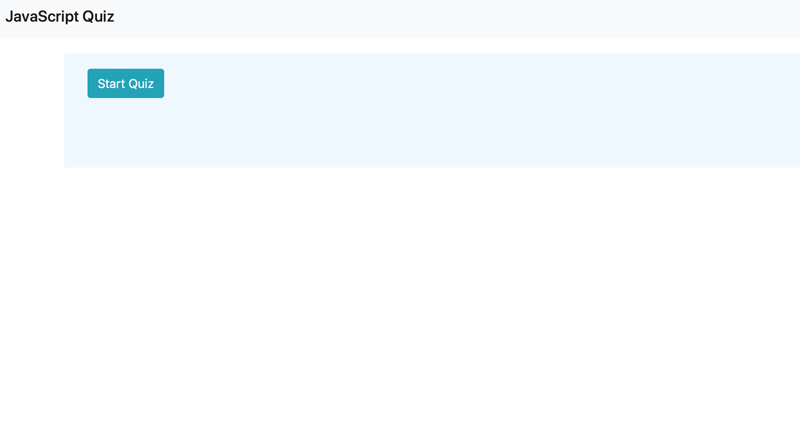
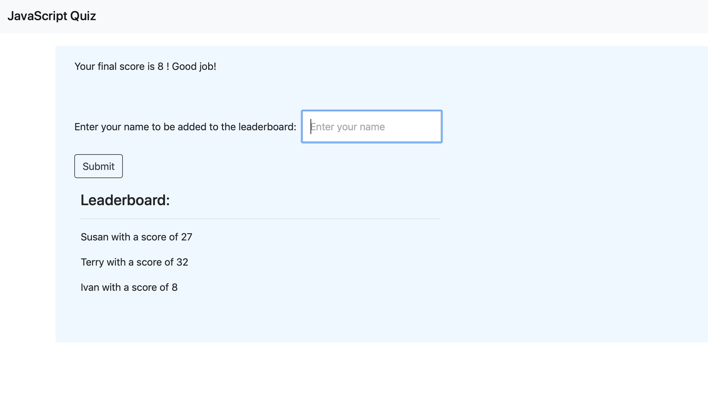
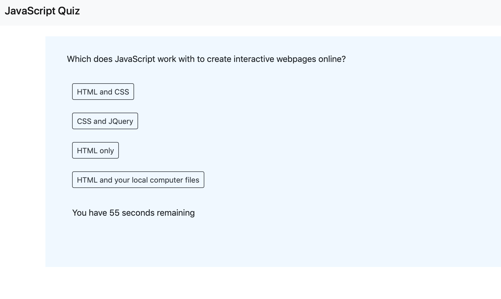

# JavaScriptQuiz

Simple, JavaScript Quiz application which prompts the user with questions about JavaScript. As they go, a time counts down. If the user selects the correct answer, they move to the next question with no penalty, but if the user selects the incorrect answer, they move to the next question and their timer count goes down by an additional 5 seconds
When they get to the end of the quiz, their remaining time is displayed as their score

They have the option to input their initials to be listed with names of others' scores

# Webpage photo files

- Start screen: 
- Question: 
- Final screen: 
